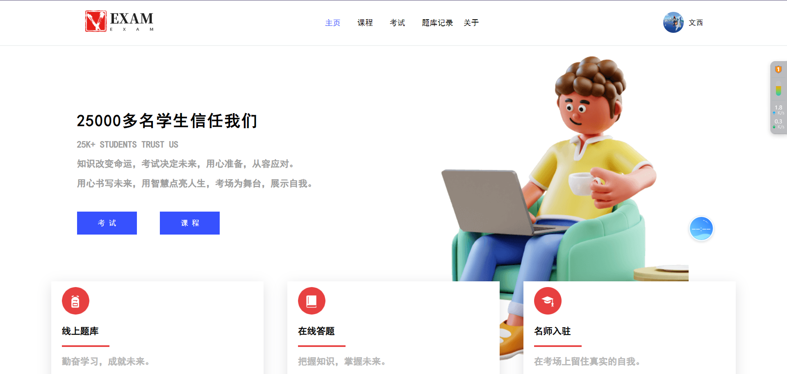
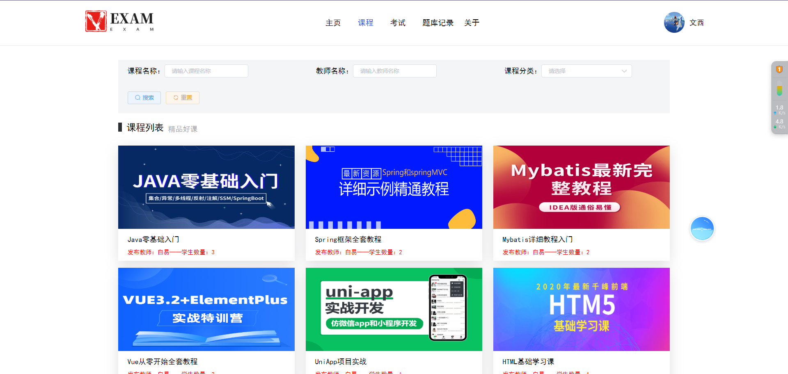
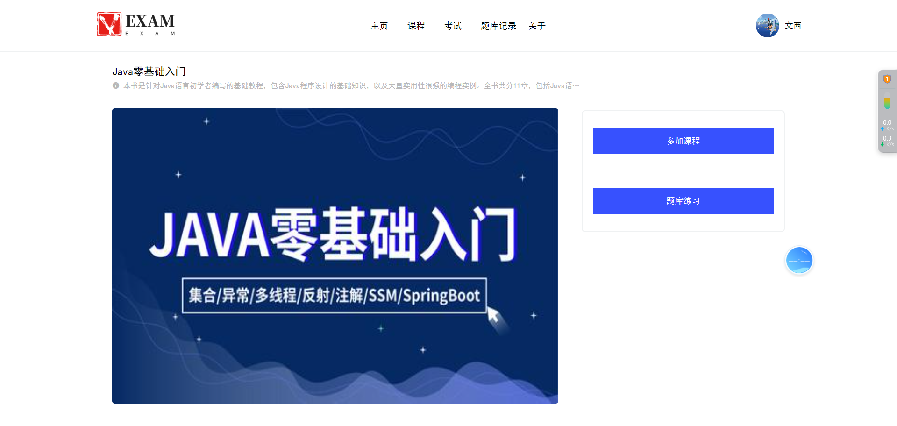
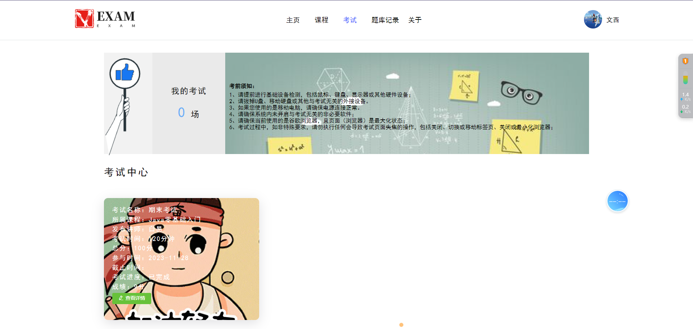
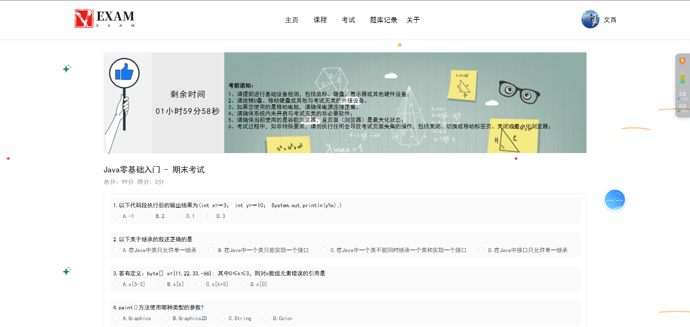
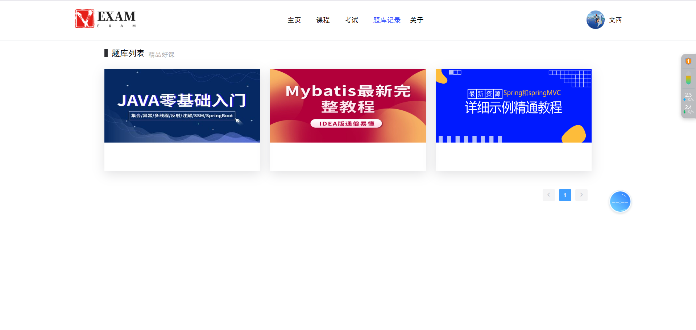
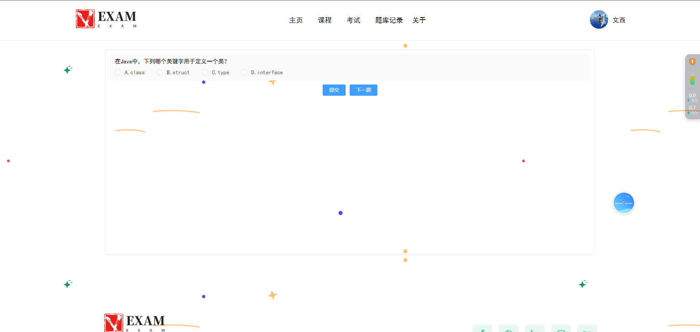
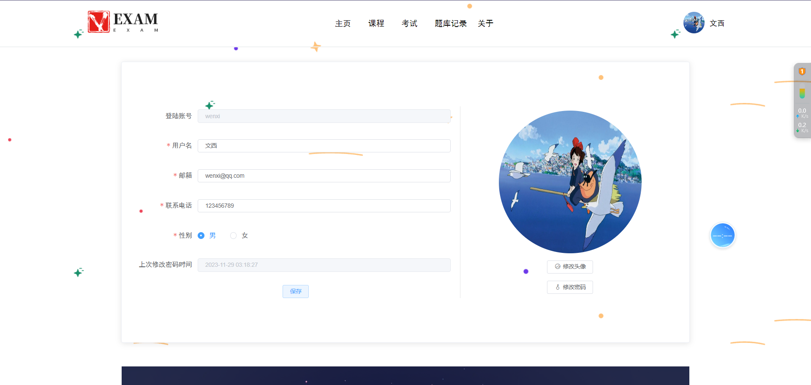
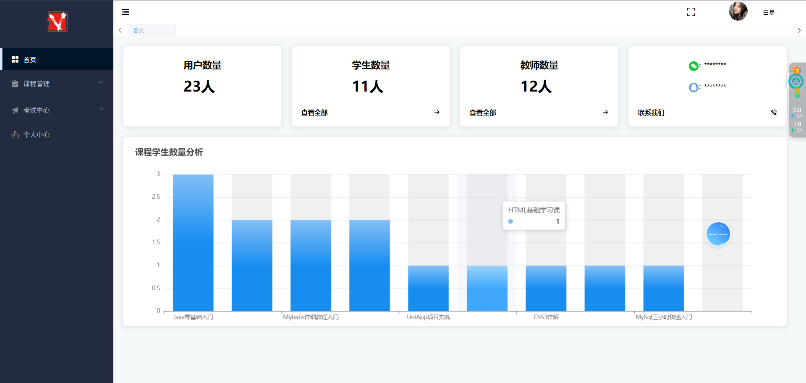
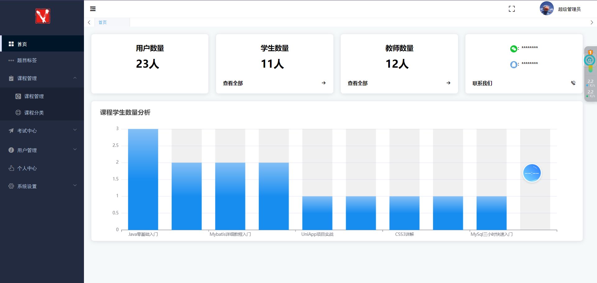

# SpringBoot+Vue的在线考试系统

**有问题可以咨询企鹅Q1760272627** 

### 功能：
系统的三个主要模块：

管理员后台、教师后台和学生前台。

管理员后台包括个人中心、学生管理、教师管理、部门管理、菜单管理、日志管理、课程管理、考试管理、首页统计等功能。

教师后台包括个人中心、首页统计、考试管理、课程管理等功能。

学生前台包括个人中心、题库查询、课程管理和考试管理等功能。

### 采用技术：
SpringBoot，shiro，Mybatis-plus，Vue，redis，mysql，ElementUi，echarts

### 工具：
idea，vscode，navicat

### 系统截图：

用户：

教师：

管理员：

**有问题可以咨询企鹅Q1760272627** 
